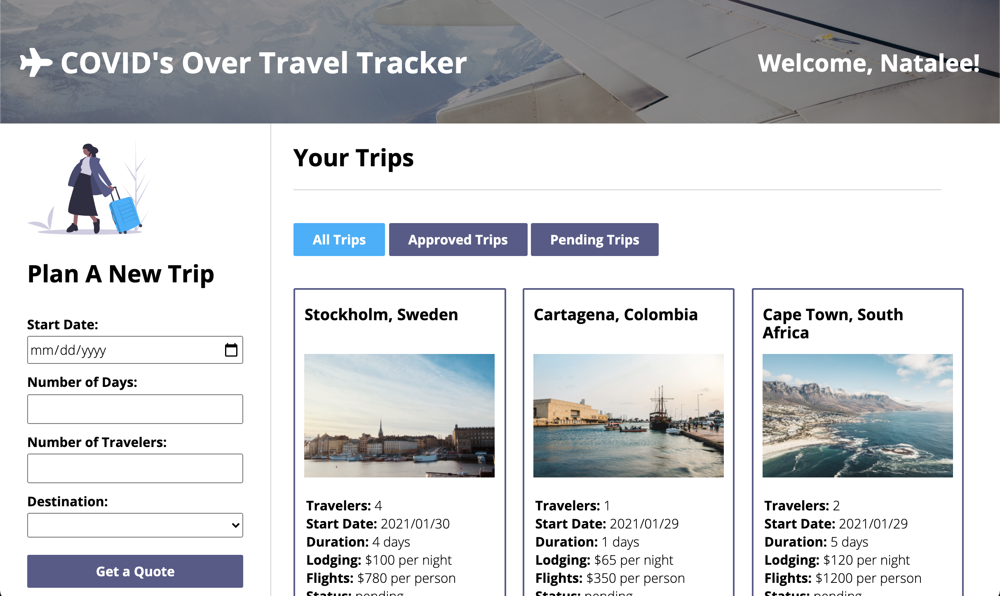
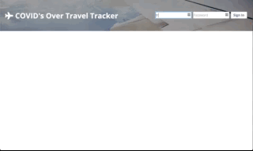
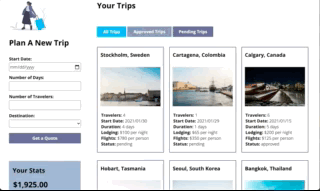
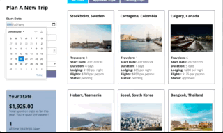
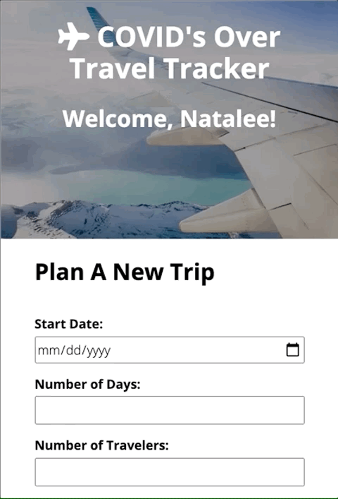

# COVID'S Over Travel Tracker

---

#### A project for when we can travel the world again.

---

## Table of Contents
* [Introduction](#introduction)
* [Features](#features)
* [Technologies](#technologies)
* [Deployment](#deployment)
* [Authors](#authors)

## Introduction
The primary goal of this project was to create an application for a traveler to manage and track their trips via a travel agency. A user can log in to see a dashboard with their past, present, future, and pending trips and destination info, along with some stats about their travels. They can also fill out a form to send a new trip request to their travel agent. The specifications can be found [here](https://frontend.turing.io/projects/travel-tracker.html).

## Motivation
* Use OOP to drive the design of the application and the code
* Work with an API to send and receive data
* Solidify the code review process
* Create a robust test suite that thoroughly tests all functionality of a client-side application

---

## Features
* [Login](#Login)
* [Filter Trips](#Filter-Trips)
* [Plan A New Trip](#Plan-A-New-Trip)

#### Login
When the page is first opened, the user sees all of the available recipes on the page in little cards.

    

      
Under the Hood

      The recipes are created by using `fetch` to request recipe data and then displayed on cards that are created in the DOM.
    

#### Filter Trips
You'll find all of the recipes you need here, but that can be a lot to handle, so we got a search bar, baby! Just type in a recipe name or ingredient, and we'll find everything that suits your needs.  

    

      
Under the Hood

      When the user starts to type into the search bar, the recipes are filtered first by name and then by ingredient. The recipes that do not match the search criteria are then hidden from view.
    

#### Plan A New Trip
Another way to narrow down your recipe selection is to use the filter feature. On the left side, select a type of recipe to display, then click "Filter Recipes", and you'll only see the recipes that fit those tags.

    

      
Under the Hood

      When the user selects a tag and presses the button, all of the recipes whose tags do NOT include the selected tag/s are hidden from the page. When the user selects more than one tag, the recipe's tags must include ALL of the selected tags to not be hidden.
    

---

#### Accessibility & Responsive Design
This app was built with all users in mind. I used Lighthouse and [WAVE](https://wave.webaim.org/) to work towards including as broad of an audience as I could. Of course, as I am committed to including all users, I am happy to make future edits to address any areas that I may have missed.

#### Continuous Improvement/Future Improvements
- Add a travel agency with their own login and dashboard of new trip requests ("pending" trips). Allow them to see their total income generated this year and travelers on trips for today's date. Allow them to approve/deny trip requests, search users by name, view a single user's info, add suggested activities, and delete an upcoming trip for the user. Allow them to create new destinations.
- Add a countdown to their next trip on the user dashboard.
- Implement more robust trip filtering on the current site (this feature would be especially necessary as the application scales and users add more trips)

---

## Technologies
JavaScript, Fetch/Async, JSON, Mocha, Chai, HTML5, SASS, Normalize, Webpack

## Deployment
This app requires a local server to be running independent of GH. Clone down [this repo](https://github.com/turingschool-examples/travel-tracker-api) and follow the instructions in the README. Once the server is running on your local machine, the site can be seen in all of it's glory here:

[Deployment Link](https://tashiad.github.io/travel-tracker/dist/index.html)

## Author
<table>
    <tr>
        <td> Tashia Davis <a href="https://github.com/tashiad">GH</td>
    </tr>
 <td></td>
</table>
